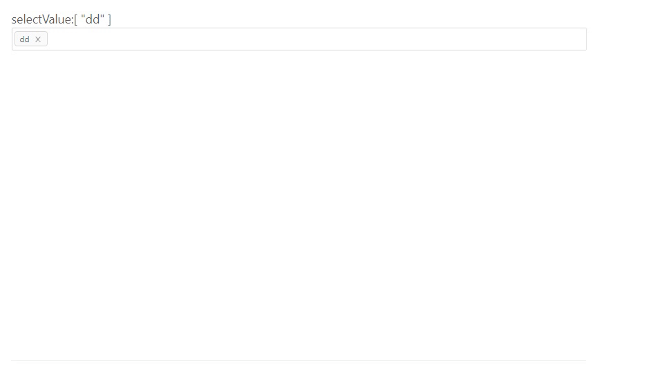

# vue-select-added

> A Vue.js 2.0 select added component

<p align="center">
  
</p>

## Installation

#### NPM / Yarn

```bash
npm install vue-select-added --save
```

Then you need to import and register it:

```js
import SelectAdded from "vue-select-added";
```

```js
components: {
  SelectAdded;
}
```

## Usage

```js
<SelectAdded
  :allArr="items"
  v-model="selectValue"
/>/>
```

## Props
| Name | Type | Default | Description |
| ---:| --- | ---| --- |
| value | Array | [] | Selected value |
| allArr | Array | [] | Available options |
| searchText | String | "请输入" | Search box default |
<!-- | read-only | Boolean | false | Set input to readonly | -->
| searchResultText | String | "未搜索到相关内容" | No search results |
| addItemButtonText | String | "添加一个新属性值" | Add new option button text |
| addItemText | String | "添加一个新项" | Add item input box prompt |
